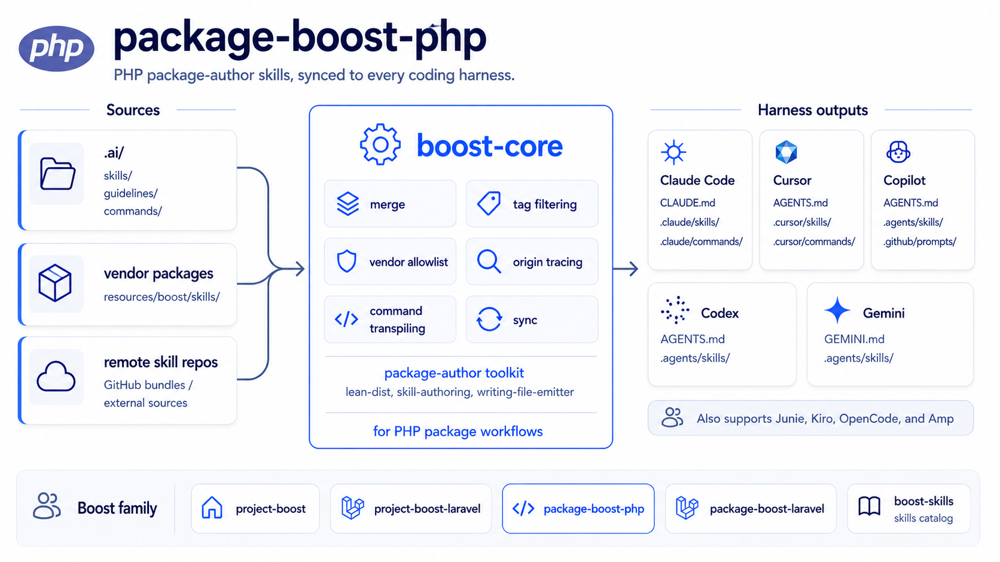

# package-boost-php

[](https://packagist.org/packages/sandermuller/package-boost-php)
[](https://github.com/sandermuller/package-boost-php/actions/workflows/run-tests.yml)
[](https://packagist.org/packages/sandermuller/package-boost-php)
[](LICENSE)
[](https://github.com/laravel/boost)

AI agent skills, guidelines, and `.gitattributes` commands for framework-agnostic Composer package authors. Sibling of [`sandermuller/package-boost-laravel`](https://github.com/sandermuller/package-boost-laravel) (Laravel-package flavor); both ride the [`sandermuller/boost-core`](https://github.com/sandermuller/boost-core) sync engine.



> Where [`laravel/boost`](https://github.com/laravel/boost) ships Laravel application guidelines, `package-boost-php` ships package-author CLI infrastructure (`vendor/bin/package-boost-php lean` + `gitattributes`) and skill-authoring tooling for the boost ecosystem. Framework-agnostic, no Laravel dependency. The release-flow content skills (`readme`, `release-notes`, `upgrading`) ship from [`sandermuller/boost-skills`](https://github.com/sandermuller/boost-skills) under the `release-automation` tag.

## Which package fits your role?

| You're building                           | Install                                                                                       | Ships                                                                                     |
|-------------------------------------------|-----------------------------------------------------------------------------------------------|-------------------------------------------------------------------------------------------|
| A PHP application (not a package)         | [`sandermuller/project-boost`](https://github.com/sandermuller/project-boost)                 | App-dev skills: DDD layering, repository pattern, DI, domain modeling, legacy coexistence |
| A Laravel application                     | [`sandermuller/project-boost-laravel`](https://github.com/sandermuller/project-boost-laravel) | `laravel/boost` MCP coexistence + nine-agent fanout + tag filter + remote skills          |
| **A framework-agnostic Composer package** | **[`sandermuller/package-boost-php`](https://github.com/sandermuller/package-boost-php)**     | **Package-author skills + `lean` / `gitattributes` commands  ← you are here**             |
| A Laravel package                         | [`sandermuller/package-boost-laravel`](https://github.com/sandermuller/package-boost-laravel) | Laravel-package skills + `McpJsonEmitter`                                                 |
| Your own skill bundle, or custom tooling  | [`sandermuller/boost-core`](https://github.com/sandermuller/boost-core)                       | The sync engine. You supply the skills.                                                   |

## What you get

**Two CLI commands** — zero-overlap with `laravel/boost`. Both target `.gitattributes`, the file that controls what ends up in the Composer archive.

| Command                                      | Purpose                                                                                                                            |
|----------------------------------------------|------------------------------------------------------------------------------------------------------------------------------------|
| `vendor/bin/package-boost-php lean`          | Validate `.gitattributes` excludes non-shipping paths (tests, fixtures, CI configs, `.ai/`). Wraps `stolt/lean-package-validator`. |
| `vendor/bin/package-boost-php gitattributes` | Maintain the `# >>> package-boost (managed) >>>` block. Preserves foreign lines added by other tools.                              |

**Two guidelines** — pinned context for AI agents working in a package codebase.

| Guideline             | Scope                                                                                              | Tag                  |
|-----------------------|----------------------------------------------------------------------------------------------------|----------------------|
| `foundation`          | Package-not-an-app rules: no `app/` / `.env`, public API is semver-governed, tests are the spec.   | —                    |
| `release-automation`  | CHANGELOG-via-CI + release-notes-in-`internal/` conventions.                                       | `release-automation` |

**Three skills** — on-demand workflows for package development.

| Skill                    | When it loads                                                          | Tag                  |
|--------------------------|------------------------------------------------------------------------|----------------------|
| `lean-dist`              | Keeping the Composer archive lean via `.gitattributes` export-ignore.  | —                    |
| `skill-authoring`        | Authoring or editing AI skills for the boost family.                   | `boost-extension`    |
| `writing-file-emitter`   | Implementing a custom `FileEmitter` for boost-core (`.mcp.json` etc.). | `boost-extension`    |

The `readme`, `release-notes`, and `upgrading` skills moved to [`sandermuller/boost-skills`](https://github.com/sandermuller/boost-skills) under the `release-automation` tag. See [UPGRADING](UPGRADING.md) for the migration note.

## Install

```bash
composer require --dev sandermuller/package-boost-php
```

PHP 8.3+ required. `sandermuller/boost-core` (the sync engine) and `stolt/lean-package-validator` (the `lean` command's checker) come in transitively — do not `require sandermuller/boost-core` separately, it resolves through this package. One package is the whole install; the auto-sync callback (below) lives under this package's own namespace so your `composer.json` never names the transitive dependency.

## First run

```bash
vendor/bin/boost install              # interactive: pick agents, allowlist vendors (writes boost.php)
vendor/bin/boost sync                 # fan out skills + guidelines to selected agents
vendor/bin/package-boost-php gitattributes   # write or refresh the managed .gitattributes block
vendor/bin/package-boost-php lean            # confirm the archive is lean
```

Generated agent dirs (`.claude/`, `.cursor/`, `.codex/`, etc.) are added to `.gitignore` automatically; root-level agent files (`AGENTS.md`, `CLAUDE.md`) are tracked, not gitignored, per boost-core's tracking model. Edit `.ai/` only, then re-run `vendor/bin/boost sync`.

## `boost.php` config

The canonical example is this repo's own dogfood config (kept at `.config/boost.php`; root `boost.php` works too):

```php
<?php declare(strict_types=1);

use SanderMuller\BoostCore\Config\BoostConfig;
use SanderMuller\BoostCore\Enums\Agent;
use SanderMuller\BoostCore\Enums\Tag;

return BoostConfig::configure()
    ->withAgents([
        Agent::CLAUDE_CODE,
        Agent::COPILOT,
        Agent::CODEX,
    ])
    ->withAllowedVendors([
        'sandermuller/boost-core',
        'sandermuller/boost-skills',
        'sandermuller/package-boost-php',
        'stolt/lean-package-validator',
    ])
    ->withTags(
        Tag::Php,
        Tag::Github,
        'release-automation',
        'boost-extension',
    );
```

The absolute minimum to boot is one agent + this package in the allowlist:

```php
return BoostConfig::configure()
    ->withAgents([Agent::CLAUDE_CODE])
    ->withAllowedVendors(['sandermuller/package-boost-php']);
```

Full configuration reference lives in [`sandermuller/boost-core`'s README](https://github.com/sandermuller/boost-core).

## Opt-in tags

`withTags(...)` filters which skills and guidelines sync. The two opt-ins this package recognises:

- `'release-automation'` — pulls this package's `release-automation` guideline (stays local), and (when `sandermuller/boost-skills` is allowlisted) the migrated `readme` / `release-notes` / `upgrading` skills from boost-skills.
- `'boost-extension'` — pulls `skill-authoring` + `writing-file-emitter` for consumers extending the boost ecosystem.

The tag *mechanism* (`withTags()`, `metadata.boost-tags`, subset-rule semantics) is documented in `boost-core`. Tag *vocabulary* is illustrative per catalog — boost-skills publishes [a worked example](https://github.com/sandermuller/boost-skills#tags); other catalogs may organise differently.

## Coexistence

The Laravel-package sibling [`sandermuller/package-boost-laravel`](https://github.com/sandermuller/package-boost-laravel) requires this package and layers Laravel-specific skills (Testbench, cross-version-Laravel, CI matrix) and `McpJsonEmitter` on top. Both packages coexist cleanly with [`laravel/boost`](https://github.com/laravel/boost) in Laravel-package projects — they handle disjoint concerns: this package is dev-time package authorship; `laravel/boost` is install-time MCP for downstream Laravel apps.

## Auto-sync

To re-sync on every `composer install` / `composer update`, wire the callback into your project's `composer.json`:

```json
"scripts": {
    "post-install-cmd": ["SanderMuller\\PackageBoostPhp\\Scripts\\AutoSync::run"],
    "post-update-cmd": ["SanderMuller\\PackageBoostPhp\\Scripts\\AutoSync::run"]
}
```

The callback lives under this package's own namespace, so you reference only `package-boost-php` and never need to `require sandermuller/boost-core` separately — one package is the whole install. `AutoSync::run` delegates to boost-core's engine and inherits every guard unchanged (it's silent on a no-op install, skips on `--no-dev`, and honours `BOOST_SKIP_AUTOSYNC`). For a script you invoke yourself (e.g. `composer sync-ai`) where silence reads as nothing happening, use `SanderMuller\PackageBoostPhp\Scripts\AutoSync::runWithSummary` instead — it always prints the one-line summary.

`BOOST_SKIP_AUTOSYNC=1` disables the callback.

## Testing

```bash
composer test       # Pest suite
composer qa         # Rector + Pint + PHPStan + .gitattributes validator
```

## License

MIT. See [LICENSE](LICENSE).
